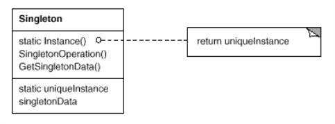

# Le design pattern : Singleton
Implémentation d'un singleton

## Le patterns de base :

## Le code sources :
https://github.com/BertonFred/Singleton

## Liens sur le net :
https://www.e-naxos.com/Blog/post/Singleton-qui-es-tu-.aspx
https://jlambert.developpez.com/tutoriels/dotnet/implementation-pattern-singleton-csharp/

